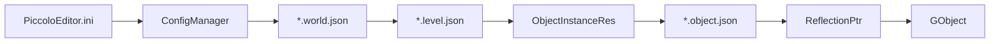

# Piccolo 架构总览

最后整理日期: 2026-07-05

本文基于一次静态代码浏览整理，目的是帮助新人快速建立 Piccolo 小引擎的代码地图。当前没有执行完整构建或运行验证。

## 一句话定位

Piccolo 是一个教学取向的小型 C++17 游戏引擎。它以 `Runtime` 为核心，`Editor` 作为上层可执行程序，使用自研反射和 JSON 序列化驱动资源、组件和编辑器属性面板，渲染后端当前落在 Vulkan。

## 顶层模块

```text
PiccoloEditor.exe
  -> editor: 编辑器 UI、场景选择、gizmo、资产面板
  -> runtime: core、platform、resource、function
  -> meta_parser: libclang + mustache 生成反射/序列化代码
  -> shader: glslangValidator 编译 GLSL shader
```

主要构建目标:

| 目标 | 位置 | 作用 |
| --- | --- | --- |
| `PiccoloRuntime` | `engine/source/runtime` | 引擎核心静态库 |
| `PiccoloEditor` | `engine/source/editor` | 编辑器可执行程序 |
| `PiccoloParser` | `engine/source/meta_parser` | 构建期反射/序列化代码生成器 |
| `PiccoloPreCompile` | `engine/source/precompile` | 调用 parser 生成 `_generated` 代码 |
| `PiccoloShaderCompile` | `engine/shader` | 编译 shader 并生成 C++ 头 |

## Runtime 分层

`engine/source/runtime` 下有四个主要目录:

| 目录 | 职责 |
| --- | --- |
| `core` | 数学、日志、颜色、反射、序列化基础设施 |
| `platform` | 文件服务、路径等平台相关封装 |
| `resource` | 配置、资产管理、反序列化后的资源类型 |
| `function` | 世界、对象、组件、输入、渲染、物理、粒子、动画、UI 等运行时系统 |

`RuntimeGlobalContext` 是全局 service locator，统一创建和销毁各系统。初始化顺序大致是:

```text
ConfigManager
FileSystem
LogSystem
AssetManager
PhysicsManager
WorldManager
WindowSystem
InputSystem
ParticleManager
RenderSystem
DebugDrawManager
RenderDebugConfig
```

## 启动和主循环

入口在 `engine/source/editor/source/main.cpp`:

```text
main
  -> PiccoloEngine::startEngine(config)
       -> Reflection::TypeMetaRegister::metaRegister()
       -> RuntimeGlobalContext::startSystems()
  -> PiccoloEngine::initialize()
  -> PiccoloEditor::initialize(engine)
  -> PiccoloEditor::run()
```

普通 runtime 帧逻辑在 `PiccoloEngine::tickOneFrame()` 中:

```text
logicalTick(delta_time)
  -> WorldManager::tick()
  -> InputSystem::tick()
calculateFPS()
RenderSystem::swapLogicRenderData()
rendererTick(delta_time)
WindowSystem::pollEvents()
```

编辑器模式下，`PiccoloEditor::run()` 在 engine tick 前额外执行 editor scene/input tick，然后复用同一个 `PiccoloEngine::tickOneFrame()`。

## 资源到对象

默认配置来自 `PiccoloEditor.ini`，其中 `DefaultWorld` 指向 `asset/world/hello.world.json`。资源加载路径大致是:



关键资源类型:

| 类型 | 位置 | 内容 |
| --- | --- | --- |
| `WorldRes` | `resource/res_type/common/world.h` | world 名称、level 列表、默认 level |
| `LevelRes` | `resource/res_type/common/level.h` | 重力、当前角色名、对象实例列表 |
| `ObjectInstanceRes` | `resource/res_type/common/object.h` | 对象名、definition URL、实例组件覆盖 |
| `ObjectDefinitionRes` | `resource/res_type/common/object.h` | 默认组件列表 |

`Level` 持有 `GObjectID -> GObject` 表。`GObject` 持有 `std::vector<Reflection::ReflectionPtr<Component>>`，因此组件可以通过反射序列化、编辑器展示，并保留多态类型名。

## 组件系统

组件基类是 `Component`，核心生命周期函数是:

```text
postLoadResource(parent_object)
tick(delta_time)
```

典型组件协作:

| 组件 | 主要作用 |
| --- | --- |
| `TransformComponent` | 管理位置、旋转、缩放和 dirty flag |
| `MeshComponent` | 将 mesh/material/animation 结果提交到 `RenderSwapContext` |
| `RigidBodyComponent` | 向当前 `PhysicsScene` 创建或更新 Jolt rigid body |
| `CameraComponent` | 根据角色和输入生成 `CameraSwapData` |
| `MotorComponent` | 角色移动和控制器逻辑 |
| `AnimationComponent` | 动画采样和骨骼结果 |
| `ParticleComponent` | 创建 emitter 并提交粒子 tick/transform 请求 |
| `LuaComponent` | 通过反射按字符串路径访问组件字段或方法 |

需要注意: 部分组件之间存在隐式 tick 顺序和 dirty flag 约定，例如 Transform、RigidBody、Mesh 之间的更新链。

## 渲染架构

`RenderSystem` 由四块核心对象组成:

```text
RenderSystem
  -> RHI               当前实现为 VulkanRHI
  -> RenderScene       可见对象、灯光、实例 ID 映射
  -> RenderResource    mesh/material/global resource 上传和缓存
  -> RenderPipeline    pass 组合和实际绘制流程
```

逻辑侧组件不直接改 GPU 资源，而是写入 `RenderSwapContext`。渲染侧在 `RenderSystem::processSwapData()` 消费这些数据:

```text
GameObjectDesc      -> 上传/更新 mesh、material、render entity
CameraSwapData      -> 更新 RenderCamera
Particle requests   -> 更新 ParticlePass emitter 和 transform
Delete requests     -> 从 RenderScene 移除 entity
```

当前 pipeline 包含:

```text
DirectionalLightShadowPass
PointLightShadowPass
MainCameraPass
ParticlePass
ToneMappingPass
ColorGradingPass
FXAAPass
UIPass
CombineUIPass
PickPass
```

每帧渲染大致是:

```text
processSwapData()
RHI::prepareContext()
RenderResource::updatePerFrameBuffer()
RenderScene::updateVisibleObjects()
RenderPipeline::preparePassData()
DebugDrawManager::tick()
RenderPipeline::forwardRender() 或 deferredRender()
```

## 物理、输入和粒子

物理使用 Jolt。`PhysicsManager` 管多个 `PhysicsScene`，当前每个 `Level` 创建一个物理场景。`PhysicsScene::createRigidBody()` 中注释显示当前刚体创建主要支持 static object。

输入使用 GLFW callback 汇总成 `GameCommand` bitmask。非 editor 模式下，active character 读取输入，配合 Motor/Camera/Transform 组件驱动角色和相机。

粒子逻辑由 `ParticleManager` 读取全局粒子资源并创建 emitter 请求，实际 GPU 资源、模拟和绘制主要落在 `ParticlePass`。

## Editor 架构

Editor 不另起一套 engine，而是在 runtime 启动后进入 editor mode:

```text
PiccoloEditor::initialize()
  -> g_is_editor_mode = true
  -> EditorGlobalContext::initialize()
  -> EditorSceneManager::setEditorCamera(RenderCamera)
  -> EditorUI::initialize()
```

编辑器主要模块:

| 模块 | 职责 |
| --- | --- |
| `EditorUI` | ImGui dock UI、菜单、对象列表、资产树、详情面板、游戏视口 |
| `EditorSceneManager` | 选中对象、拾取、gizmo 轴、编辑器相机 |
| `EditorInputManager` | 编辑器视口输入和相机控制 |
| `EditorFileService` | 资产目录树 |

详情面板基于反射生成 UI。`EditorUI` 为 `bool/int/float/Vector3/Quaternion/std::string/Transform` 等类型注册了绘制函数。

## 反射和序列化生成

反射宏位于 `runtime/core/meta/reflection/reflection.h`。正常编译时 `CLASS/META` 基本退化为空；当 parser 扫描时，它们变成 clang annotation。

构建期流程:

```text
PiccoloParser
  -> 扫描 runtime/editor 头文件
  -> 读取 REFLECTION_TYPE / CLASS / REFLECTION_BODY 等标记
  -> 使用 engine/template 下的 mustache 模板
  -> 生成 engine/source/_generated/reflection 和 _generated/serializer
```

运行时 `AssetManager::loadAsset()` 读取 JSON，交给生成的 `Serializer::read()` 填充 C++ 资源对象。保存则走 `Serializer::write()`。

## 主要第三方依赖

| 依赖 | 用途 |
| --- | --- |
| Vulkan SDK + VMA | 图形 API 和显存分配 |
| GLFW | 窗口和输入 |
| ImGui | 编辑器 UI |
| Jolt Physics | 物理 |
| Lua + sol2 | 脚本 |
| spdlog | 日志 |
| tinyobjloader/stb | 模型和图像加载 |
| json11 | JSON 解析 |
| libclang | 构建期反射解析 |

## 当前观察到的风险点

- `RuntimeGlobalContext` 简洁直接，但系统耦合较强，新增系统时要注意初始化和销毁顺序。
- 组件 tick 依赖隐式约定，特别是 Transform dirty flag 被 Mesh 清理这一类流程。
- RHI 有抽象接口，但实现和数据结构仍明显围绕 Vulkan。
- `LuaComponent` 当前每帧执行脚本文本，适合教学演示，性能和错误隔离较弱。
- `engine/source/editor/CMakeLists.txt` 中 `PICCOLO_EDITOR_HEADS` 一行看起来包含弯引号，构建代码生成前建议检查是否会影响 `precompile.json`。

